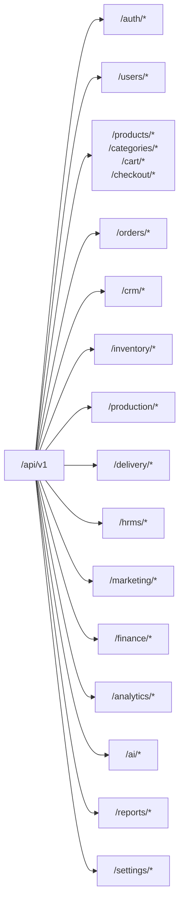
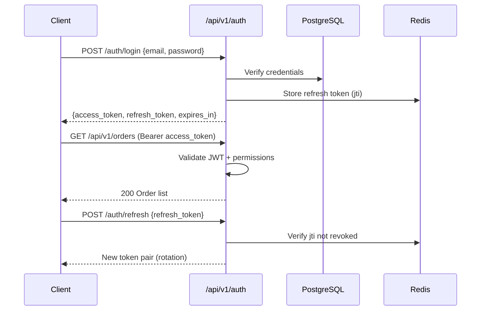

# API Architecture — Archana Commerce OS

## 1. API Design Philosophy

- **REST-first** with OpenAPI 3.1 auto-generated from FastAPI
- **Versioned** under `/api/v1/` — breaking changes require `/api/v2/`
- **Resource-oriented** URLs with consistent plural nouns
- **JSON** request/response bodies (camelCase in JSON, snake_case in Python)
- **Idempotent** mutations via `Idempotency-Key` header on POST
- **Paginated** list endpoints with cursor-based pagination
- **Tenant-aware** via `X-Tenant-ID` header or JWT `tenant_id` claim

---

## 2. API Gateway Structure

```
backend/api/
├── main.py                 # FastAPI app factory
├── middleware/
│   ├── cors.py
│   ├── rate_limit.py
│   ├── request_id.py
│   ├── tenant_context.py
│   └── audit_log.py
├── router.py               # Aggregates all module routers
├── health.py               # /health, /ready
├── exception_handlers.py
└── dependencies/
    ├── auth.py             # get_current_user, require_permission
    └── pagination.py
```

### Router Mounting

```python
# backend/api/router.py (conceptual)
api_v1 = APIRouter(prefix="/api/v1")

api_v1.include_router(auth_router,       prefix="/auth",       tags=["Auth"])
api_v1.include_router(users_router,      prefix="/users",      tags=["Users"])
api_v1.include_router(ecommerce_router,  prefix="/products",   tags=["Ecommerce"])
api_v1.include_router(orders_router,     prefix="/orders",     tags=["Orders"])
api_v1.include_router(crm_router,        prefix="/crm",        tags=["CRM"])
api_v1.include_router(inventory_router,  prefix="/inventory",  tags=["Inventory"])
api_v1.include_router(production_router, prefix="/production", tags=["Production"])
api_v1.include_router(delivery_router,   prefix="/delivery",   tags=["Delivery"])
api_v1.include_router(hrms_router,       prefix="/hrms",       tags=["HRMS"])
api_v1.include_router(marketing_router,  prefix="/marketing",  tags=["Marketing"])
api_v1.include_router(finance_router,    prefix="/finance",     tags=["Finance"])
api_v1.include_router(analytics_router,  prefix="/analytics",  tags=["Analytics"])
api_v1.include_router(ai_router,         prefix="/ai",         tags=["AI"])
api_v1.include_router(reports_router,    prefix="/reports",    tags=["Reports"])
api_v1.include_router(settings_router,   prefix="/settings",   tags=["Settings"])
```

---

## 3. URL Namespace Map



---

## 4. Authentication & Authorization

### Auth Flow



### Token Structure

```json
{
  "sub": "user_uuid",
  "tenant_id": "tenant_uuid",
  "roles": ["admin", "sales_manager"],
  "permissions": ["orders:read", "orders:write", "crm:read"],
  "exp": 1710000000,
  "jti": "unique_token_id"
}
```

### Permission Format

`{module}:{action}` where action ∈ `read | write | delete | admin`

Examples: `inventory:read`, `hrms:admin`, `ai:write`

---

## 5. Standard Response Envelope

### Success (single resource)

```json
{
  "data": { "id": "uuid", "name": "Kaju Katli" },
  "meta": {
    "requestId": "req_abc123"
  }
}
```

### Success (list)

```json
{
  "data": [ { "id": "uuid", "name": "Kaju Katli" } ],
  "meta": {
    "requestId": "req_abc123",
    "pagination": {
      "cursor": "eyJpZCI6...",
      "hasMore": true,
      "total": 142
    }
  }
}
```

### Error

```json
{
  "error": {
    "code": "VALIDATION_ERROR",
    "message": "Invalid input",
    "details": [
      { "field": "email", "message": "Invalid email format" }
    ]
  },
  "meta": {
    "requestId": "req_abc123"
  }
}
```

### HTTP Status Codes

| Code | Usage |
|------|-------|
| 200 | Successful GET, PUT, PATCH |
| 201 | Successful POST (created) |
| 204 | Successful DELETE |
| 400 | Validation error |
| 401 | Missing/invalid token |
| 403 | Insufficient permissions |
| 404 | Resource not found |
| 409 | Conflict (duplicate, stale state) |
| 422 | Unprocessable business rule |
| 429 | Rate limited |
| 500 | Internal server error |

---

## 6. Endpoint Catalog by Module

### Auth (`/api/v1/auth`)

| Method | Endpoint | Description | Auth |
|--------|----------|-------------|------|
| POST | `/auth/register` | Customer registration | Public |
| POST | `/auth/login` | Email/password login | Public |
| POST | `/auth/login/otp` | Request OTP | Public |
| POST | `/auth/verify-otp` | Verify OTP | Public |
| POST | `/auth/google` | Google OAuth | Public |
| POST | `/auth/refresh` | Refresh tokens | Refresh token |
| POST | `/auth/logout` | Revoke refresh token | Bearer |
| POST | `/auth/forgot-password` | Password reset request | Public |
| POST | `/auth/reset-password` | Reset with token | Public |

### Users (`/api/v1/users`)

| Method | Endpoint | Description | Permission |
|--------|----------|-------------|------------|
| GET | `/users/me` | Current user profile | Authenticated |
| PATCH | `/users/me` | Update profile | Authenticated |
| GET | `/users` | List users (admin) | `users:read` |
| POST | `/users` | Create user | `users:write` |
| GET | `/users/{id}` | Get user | `users:read` |
| PATCH | `/users/{id}` | Update user | `users:write` |
| DELETE | `/users/{id}` | Deactivate user | `users:delete` |
| GET | `/users/roles` | List roles | `users:admin` |
| POST | `/users/roles` | Create role | `users:admin` |

### Ecommerce (`/api/v1`)

| Method | Endpoint | Description | Permission |
|--------|----------|-------------|------------|
| GET | `/products` | List products | Public |
| GET | `/products/{slug}` | Product detail | Public |
| POST | `/products` | Create product | `ecommerce:write` |
| PATCH | `/products/{id}` | Update product | `ecommerce:write` |
| DELETE | `/products/{id}` | Soft delete | `ecommerce:delete` |
| GET | `/categories` | Category tree | Public |
| POST | `/categories` | Create category | `ecommerce:write` |
| GET | `/cart` | Get cart | Authenticated |
| POST | `/cart/items` | Add to cart | Authenticated |
| PATCH | `/cart/items/{id}` | Update quantity | Authenticated |
| DELETE | `/cart/items/{id}` | Remove item | Authenticated |
| POST | `/checkout` | Initiate checkout | Authenticated |
| POST | `/checkout/confirm` | Confirm payment | Authenticated |

### Orders (`/api/v1/orders`)

| Method | Endpoint | Description | Permission |
|--------|----------|-------------|------------|
| GET | `/orders` | List orders | `orders:read` or own |
| POST | `/orders` | Create order | Authenticated |
| GET | `/orders/{id}` | Order detail | `orders:read` or own |
| PATCH | `/orders/{id}/status` | Update status | `orders:write` |
| POST | `/orders/{id}/returns` | Initiate return | Authenticated |
| POST | `/orders/{id}/refunds` | Process refund | `orders:admin` |
| GET | `/orders/track/{tracking_id}` | Public tracking | Public |

### CRM (`/api/v1/crm`)

| Method | Endpoint | Description | Permission |
|--------|----------|-------------|------------|
| GET | `/crm/leads` | List leads | `crm:read` |
| POST | `/crm/leads` | Create lead | `crm:write` |
| PATCH | `/crm/leads/{id}` | Update lead | `crm:write` |
| GET | `/crm/customers` | List customers | `crm:read` |
| GET | `/crm/customers/{id}` | Customer 360 | `crm:read` |
| POST | `/crm/activities` | Log activity | `crm:write` |
| GET | `/crm/follow-ups` | Pending follow-ups | `crm:read` |
| POST | `/crm/follow-ups` | Schedule follow-up | `crm:write` |

### Inventory (`/api/v1/inventory`)

| Method | Endpoint | Description | Permission |
|--------|----------|-------------|------------|
| GET | `/inventory/items` | List stock items | `inventory:read` |
| POST | `/inventory/items` | Create item | `inventory:write` |
| PATCH | `/inventory/items/{id}` | Update stock | `inventory:write` |
| POST | `/inventory/movements` | Record movement | `inventory:write` |
| GET | `/inventory/suppliers` | List suppliers | `inventory:read` |
| POST | `/inventory/suppliers` | Add supplier | `inventory:write` |
| GET | `/inventory/low-stock` | Low stock alerts | `inventory:read` |

### Production (`/api/v1/production`)

| Method | Endpoint | Description | Permission |
|--------|----------|-------------|------------|
| GET | `/production/recipes` | List recipes | `production:read` |
| POST | `/production/recipes` | Create recipe | `production:write` |
| GET | `/production/batches` | List batches | `production:read` |
| POST | `/production/batches` | Start batch | `production:write` |
| PATCH | `/production/batches/{id}` | Update batch | `production:write` |
| GET | `/production/planning` | Production schedule | `production:read` |

### Delivery (`/api/v1/delivery`)

| Method | Endpoint | Description | Permission |
|--------|----------|-------------|------------|
| GET | `/delivery/assignments` | Driver assignments | `delivery:read` |
| POST | `/delivery/assignments` | Assign delivery | `delivery:write` |
| PATCH | `/delivery/{id}/status` | Update status | `delivery:write` |
| POST | `/delivery/{id}/verify-otp` | OTP verification | `delivery:write` |
| GET | `/delivery/routes/optimize` | Route optimization | `delivery:read` |
| GET | `/delivery/tracking/{id}` | Live tracking | Public/Auth |

### HRMS (`/api/v1/hrms`)

| Method | Endpoint | Description | Permission |
|--------|----------|-------------|------------|
| GET | `/hrms/employees` | List employees | `hrms:read` |
| POST | `/hrms/employees` | Add employee | `hrms:write` |
| POST | `/hrms/attendance/check-in` | Check in | `hrms:write` |
| POST | `/hrms/attendance/check-out` | Check out | `hrms:write` |
| GET | `/hrms/attendance` | Attendance records | `hrms:read` |
| GET | `/hrms/payroll` | Payroll runs | `hrms:read` |
| POST | `/hrms/payroll/generate` | Generate payroll | `hrms:admin` |

### Marketing (`/api/v1/marketing`)

| Method | Endpoint | Description | Permission |
|--------|----------|-------------|------------|
| GET | `/marketing/campaigns` | List campaigns | `marketing:read` |
| POST | `/marketing/campaigns` | Create campaign | `marketing:write` |
| POST | `/marketing/campaigns/{id}/send` | Send campaign | `marketing:write` |
| POST | `/marketing/whatsapp/send` | WhatsApp message | `marketing:write` |
| POST | `/marketing/email/send` | Email blast | `marketing:write` |
| GET | `/marketing/seo/pages` | SEO metadata | `marketing:read` |
| PATCH | `/marketing/seo/pages/{id}` | Update SEO | `marketing:write` |

### Analytics (`/api/v1/analytics`)

| Method | Endpoint | Description | Permission |
|--------|----------|-------------|------------|
| GET | `/analytics/revenue` | Revenue dashboard | `analytics:read` |
| GET | `/analytics/sales` | Sales metrics | `analytics:read` |
| GET | `/analytics/customers` | Customer analytics | `analytics:read` |
| GET | `/analytics/products` | Product performance | `analytics:read` |
| POST | `/analytics/query` | Custom date-range query | `analytics:read` |

### AI (`/api/v1/ai`)

| Method | Endpoint | Description | Permission |
|--------|----------|-------------|------------|
| POST | `/ai/chat` | Chatbot conversation | Authenticated |
| POST | `/ai/chat/stream` | Streaming chat (SSE) | Authenticated |
| GET | `/ai/recommendations` | Product recommendations | Authenticated |
| POST | `/ai/forecast/demand` | Demand forecast | `ai:read` |
| POST | `/ai/seo/generate` | SEO content generation | `marketing:write` |
| POST | `/ai/marketing/copy` | Marketing copy | `marketing:write` |
| POST | `/ai/analytics/ask` | NL analytics query | `analytics:read` |
| POST | `/ai/rag/ingest` | Ingest documents | `ai:admin` |

### Reports (`/api/v1/reports`)

| Method | Endpoint | Description | Permission |
|--------|----------|-------------|------------|
| GET | `/reports` | List available reports | `reports:read` |
| POST | `/reports/generate` | Generate report (async) | `reports:read` |
| GET | `/reports/{id}/status` | Generation status | `reports:read` |
| GET | `/reports/{id}/download` | Download file | `reports:read` |

### Settings (`/api/v1/settings`)

| Method | Endpoint | Description | Permission |
|--------|----------|-------------|------------|
| GET | `/settings` | Tenant settings | `settings:read` |
| PATCH | `/settings` | Update settings | `settings:write` |
| GET | `/settings/integrations` | Integration config | `settings:admin` |

---

## 7. Pagination, Filtering & Sorting

### Query Parameters (lists)

```
GET /api/v1/products?cursor=eyJ...&limit=20&sort=-created_at&filter[category]=sweets&filter[status]=active&search=kaju
```

| Param | Type | Default | Description |
|-------|------|---------|-------------|
| `cursor` | string | null | Opaque cursor from previous response |
| `limit` | int | 20 | Max 100 |
| `sort` | string | `-created_at` | Prefix `-` for DESC |
| `filter[field]` | string | — | Exact match filters |
| `search` | string | — | Full-text search (ES-backed) |

---

## 8. Webhooks & Events

### Outbound Webhooks (Phase 3+)

```
POST {tenant_webhook_url}
X-Archana-Signature: sha256=...
X-Archana-Event: order.created

{ "event": "order.created", "data": { ... }, "timestamp": "ISO8601" }
```

### Internal Domain Events (Celery)

| Event | Publisher | Consumers |
|-------|-----------|-----------|
| `user.registered` | auth | marketing, crm |
| `order.created` | orders | inventory, delivery, analytics |
| `order.confirmed` | orders | inventory, production |
| `order.delivered` | delivery | loyalty, marketing |
| `stock.low` | inventory | production, marketing |
| `lead.created` | crm | marketing |
| `payroll.generated` | hrms | finance, notifications |

---

## 9. Real-Time APIs (Phase 2+)

| Protocol | Endpoint | Use Case |
|----------|----------|----------|
| SSE | `/api/v1/stream/orders` | Dashboard live order feed |
| SSE | `/api/v1/stream/delivery/{id}` | Delivery tracking |
| WebSocket | `/api/v1/ws/notifications` | In-app notifications |
| WebSocket | `/api/v1/ws/ai/chat` | Streaming AI responses |

---

## 10. API Client Architecture (Frontend)

```
packages/utils/src/api/
├── client.ts           # Axios/fetch wrapper with interceptors
├── auth.ts             # Token refresh logic
├── types.ts            # Re-exports from @archana/types
└── errors.ts           # ApiError class

packages/hooks/src/
├── useProducts.ts      # useQuery(['products', filters])
├── useOrders.ts
├── useCart.ts          # useMutation with optimistic updates
└── ...
```

### Client Rules

1. All API calls go through `apiClient` — no raw fetch in components
2. TanStack Query keys follow `['domain', 'action', ...params]`
3. Mutations invalidate related query keys
4. Server Components prefetch via `queryClient.prefetchQuery` in Next.js loaders

---

## 11. Rate Limiting

| Tier | Limit | Scope |
|------|-------|-------|
| Public | 60 req/min | Per IP |
| Authenticated | 300 req/min | Per user |
| AI endpoints | 20 req/min | Per user |
| Admin bulk | 1000 req/min | Per tenant |

Response headers: `X-RateLimit-Limit`, `X-RateLimit-Remaining`, `X-RateLimit-Reset`

---

## 12. OpenAPI & SDK Generation

- OpenAPI spec auto-generated at `/api/v1/openapi.json`
- TypeScript types generated into `@archana/types` via `openapi-typescript`
- API docs rendered at `apps/docs` using Scalar/Swagger UI
- Contract tests validate responses against OpenAPI schema in CI
