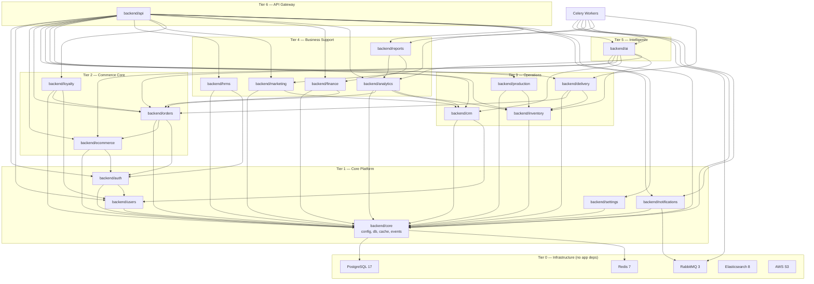
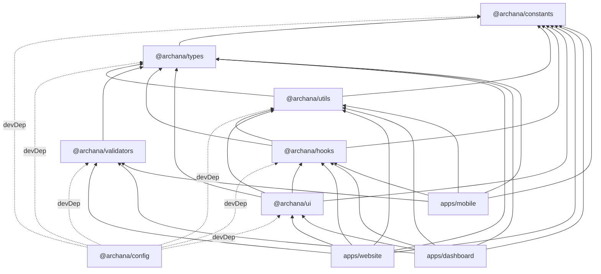

# Dependency Map — Archana Commerce OS

## 1. Runtime Dependency Graph



---

## 2. Frontend Package Dependency Map



### Package Rules

| Package | May Import From | Must NOT Import |
|---------|----------------|-----------------|
| `@archana/types` | Nothing (leaf) | Any other `@archana/*` |
| `@archana/constants` | `@archana/types` | `ui`, `hooks` |
| `@archana/validators` | `@archana/types` | `hooks`, `ui` |
| `@archana/utils` | `types`, `constants` | `ui`, `hooks` |
| `@archana/hooks` | `types`, `utils`, `constants` | `ui` |
| `@archana/ui` | All above | `apps/*` |
| `apps/*` | All packages | Other `apps/*` |

---

## 3. Backend Module Import Matrix

✅ = allowed service-layer import &nbsp;&nbsp; 🔶 = events only &nbsp;&nbsp; ❌ = forbidden

| Importer ↓ / Target → | auth | users | ecommerce | orders | crm | inventory | production | delivery | hrms | marketing | finance | analytics | ai |
|----------------------|:----:|:-----:|:---------:|:------:|:---:|:---------:|:----------:|:--------:|:----:|:---------:|:-------:|:---------:|:--:|
| **auth** | — | ✅ | ❌ | ❌ | ❌ | ❌ | ❌ | ❌ | ❌ | ❌ | ❌ | ❌ | ❌ |
| **users** | ✅ | — | ❌ | ❌ | ❌ | ❌ | ❌ | ❌ | ❌ | ❌ | ❌ | ❌ | ❌ |
| **ecommerce** | ✅ | ✅ | — | ❌ | ❌ | ❌ | ❌ | ❌ | ❌ | ❌ | ❌ | ❌ | ❌ |
| **orders** | ✅ | ✅ | ✅ | — | 🔶 | ❌ | ❌ | 🔶 | ❌ | ❌ | 🔶 | ❌ | ❌ |
| **crm** | ✅ | ✅ | ❌ | 🔶 | — | ❌ | ❌ | ❌ | ❌ | 🔶 | ❌ | ❌ | ❌ |
| **inventory** | ✅ | ❌ | ❌ | ❌ | ❌ | — | 🔶 | 🔶 | ❌ | ❌ | ❌ | ❌ | ❌ |
| **production** | ✅ | ❌ | ❌ | ❌ | ❌ | ✅ | — | ❌ | ❌ | ❌ | ❌ | ❌ | ❌ |
| **delivery** | ✅ | ✅ | ❌ | ✅ | ❌ | ✅ | ❌ | — | ❌ | ❌ | ❌ | ❌ | ❌ |
| **hrms** | ✅ | ✅ | ❌ | ❌ | ❌ | ❌ | ❌ | ❌ | — | ❌ | 🔶 | ❌ | ❌ |
| **marketing** | ✅ | ✅ | 🔶 | 🔶 | ✅ | ❌ | ❌ | ❌ | ❌ | — | ❌ | 🔶 | 🔶 |
| **finance** | ✅ | ❌ | ❌ | ✅ | ❌ | ❌ | ❌ | ❌ | 🔶 | ❌ | — | 🔶 | ❌ |
| **analytics** | ✅ | ✅ | 🔶 | ✅ | ✅ | ✅ | 🔶 | ✅ | 🔶 | ✅ | ✅ | — | ❌ |
| **ai** | ✅ | ✅ | ✅ | ✅ | ✅ | ✅ | 🔶 | 🔶 | ❌ | 🔶 | ❌ | ✅ | — |

---

## 4. External Service Dependencies

| Service | Used By | Phase | Fallback |
|---------|---------|-------|----------|
| OpenAI API | `backend/ai/*` | 4 | Queue + retry; degrade to non-AI |
| AWS S3 | ecommerce, reports, ai | 1 | Local MinIO in dev |
| Elasticsearch | ecommerce (search), ai (RAG) | 1/4 | PostgreSQL full-text (degraded) |
| Payment Gateway (Razorpay/Stripe) | orders, finance | 1 | Manual payment recording |
| WhatsApp Business API | marketing, ai/agents | 3 | Email fallback |
| Google OAuth | auth | 1 | Email/password only |
| Google Maps | delivery, website locator | 2 | Static maps |
| SMTP / SES | notifications, marketing | 1 | Log-only in dev |
| Firebase FCM | mobile notifications | 2 | In-app only |

---

## 5. NPM / Python Dependency Overview

### Root Monorepo (Node)

| Package | Version | Used In |
|---------|---------|---------|
| next | 16.x | website, dashboard, docs |
| react | 19.x | website, dashboard |
| react-native | 0.76+ | mobile |
| expo | SDK 52+ | mobile |
| typescript | 5.7+ | all TS packages |
| tailwindcss | 4.x | website, dashboard, ui |
| zustand | 5.x | website, dashboard |
| @tanstack/react-query | 5.x | website, dashboard, hooks |
| framer-motion | 11.x | website, ui |
| zod | 3.x | validators |
| turbo | 2.x | monorepo orchestration |
| pnpm | 9.x | package manager |

### Backend (Python)

| Package | Version | Purpose |
|---------|---------|---------|
| fastapi | 0.115+ | HTTP framework |
| uvicorn | 0.32+ | ASGI server |
| sqlalchemy | 2.0+ | ORM |
| alembic | 1.14+ | Migrations |
| pydantic | 2.x | Validation |
| celery | 5.4+ | Task queue |
| redis | 5.x | Cache client |
| httpx | 0.28+ | HTTP client |
| python-jose | 3.x | JWT |
| boto3 | 1.35+ | AWS S3 |
| elasticsearch | 8.x | Search client |
| langchain | 0.3+ | AI orchestration |
| langgraph | 0.2+ | AI agents |
| llama-index | 0.12+ | RAG |
| openai | 1.x | LLM API |

---

## 6. CI/CD Pipeline Dependencies

```mermaid
flowchart LR
    PUSH["Git Push"] --> LINT["Lint<br/>ESLint + Ruff"]
    LINT --> TYPE["Type Check<br/>tsc + mypy"]
    TYPE --> TEST["Test<br/>Vitest + Pytest"]
    TEST --> BUILD["Build<br/>Docker images"]
    BUILD --> SCAN["Security Scan<br/>Trivy"]
    SCAN --> DEPLOY_DEV["Deploy Dev"]
    DEPLOY_DEV --> E2E["E2E Tests<br/>Playwright"]
    E2E --> DEPLOY_STG["Deploy Staging"]
    DEPLOY_STG --> DEPLOY_PROD["Deploy Production<br/>manual approval"]
```



### Build Order (Turborepo)

```
1. @archana/types
2. @archana/constants, @archana/validators, @archana/utils  (parallel)
3. @archana/hooks
4. @archana/ui
5. apps/website, apps/dashboard, apps/mobile  (parallel)
6. backend (independent Python build)
```

---

## 7. Database Schema Dependencies

Tables must be created in dependency order during migrations:

```
Phase 1:
  tenants → roles → permissions → role_permissions
  → users → user_roles
  → categories → products → product_images
  → customers → carts → cart_items
  → orders → order_items
  → audit_logs → settings

Phase 2:
  → leads → activities → follow_ups
  → suppliers → inventory_items → stock_movements
  → recipes → recipe_items → production_batches
  → deliveries → delivery_tracking

Phase 3:
  → employees → attendance → payroll
  → campaigns → campaign_recipients
  → loyalty_programs → loyalty_transactions
  → reviews → blogs → notifications

Phase 4:
  → ai_conversations → ai_messages
  → vector_embeddings (or external vector store)

Phase 5:
  → franchises → vendors → marketplace_listings
```

---

## 8. Circular Dependency Prevention

| Risk | Prevention |
|------|-----------|
| orders ↔ inventory | orders publishes `OrderConfirmed` event; inventory subscribes |
| crm ↔ marketing | marketing reads CRM via service; CRM never imports marketing |
| ai ↔ all modules | ai is read-only consumer; writes delegated to owning module |
| frontend packages | Enforced via ESLint `import/no-restricted-paths` |
| backend modules | Enforced via `import-linter` in CI |
