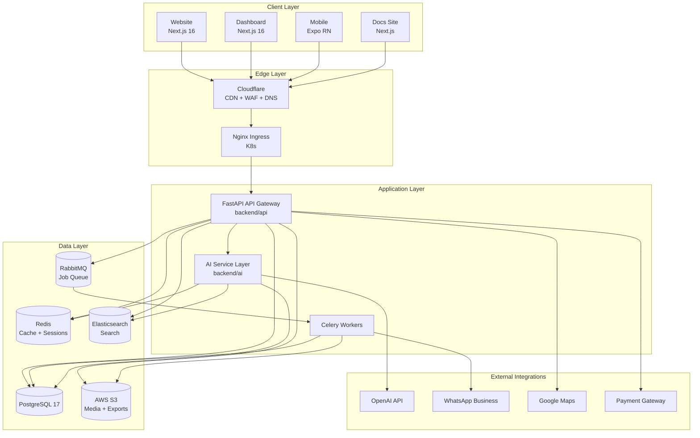
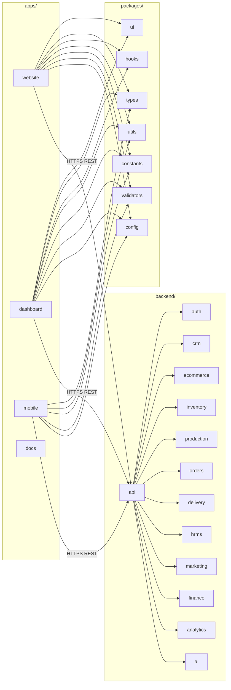
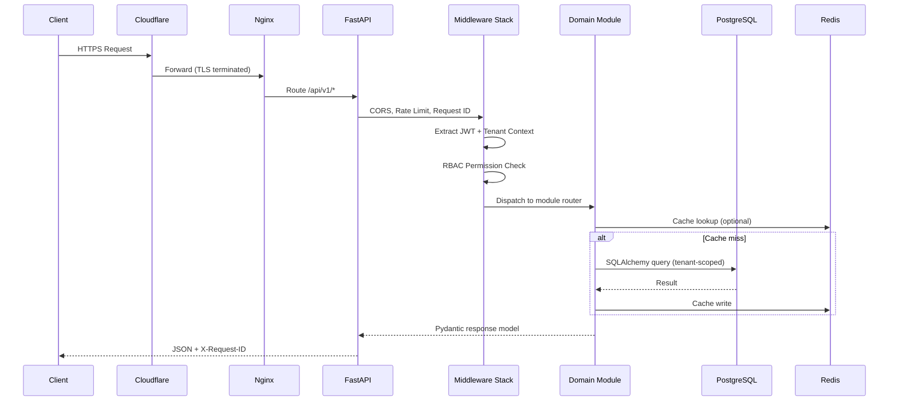
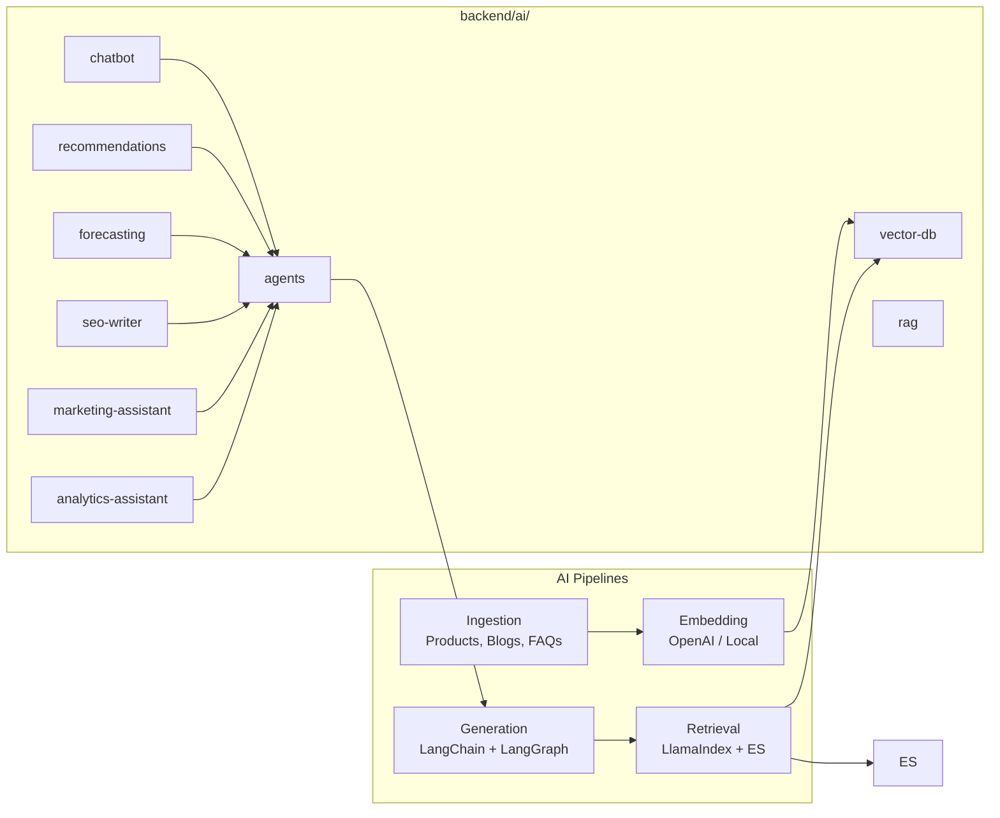
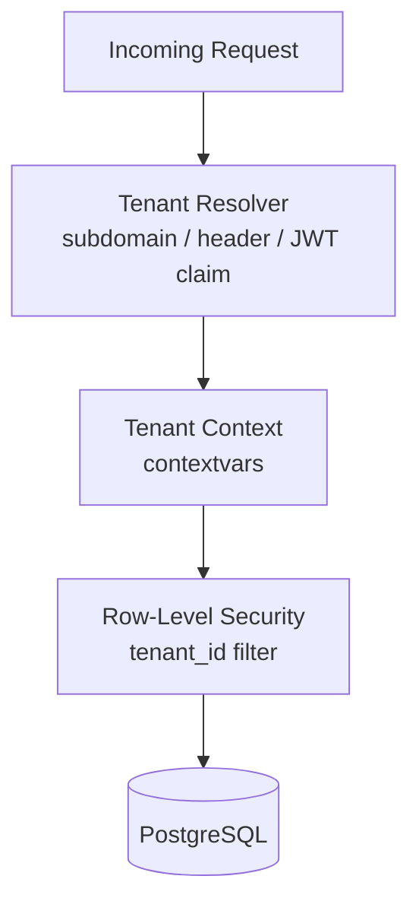
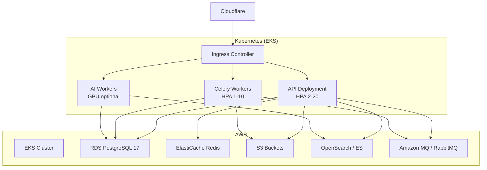

# System Architecture — Archana Commerce OS

## 1. Architectural Vision

Archana Commerce is a **modular monolith** with a **monorepo frontend**. All business domains (e-commerce, CRM, ERP, HRMS, AI) share one PostgreSQL database, one API surface, and one deployment pipeline — avoiding the operational cost of microservices while preserving domain boundaries through strict module isolation.

### Design Principles

| Principle | Implementation |
|-----------|----------------|
| Single source of truth | PostgreSQL 17 with tenant-scoped rows |
| Domain isolation | Backend modules with explicit public interfaces |
| Shared UI DNA | `@archana/ui`, `@archana/types` packages |
| API-first | OpenAPI 3.1 contract per module |
| Security by default | JWT + RBAC + tenant context on every request |
| Observable | Structured logs, metrics, traces from day one |
| AI as a module | `backend/ai/` isolated; never bypasses auth |

---

## 2. High-Level Architecture Diagram



---

## 3. Monorepo Topology



---

## 4. Request Lifecycle



---

## 5. Backend Module Architecture

Each backend module follows a **hexagonal (ports & adapters)** layout:

```
backend/{module}/
├── __init__.py
├── router.py          # FastAPI routes (thin)
├── schemas.py         # Pydantic V2 request/response
├── service.py         # Business logic
├── repository.py      # SQLAlchemy data access
├── models.py          # ORM models (or imports from shared)
├── dependencies.py    # FastAPI Depends()
├── events.py          # Domain events → Celery
├── permissions.py     # Module-specific RBAC rules
└── tests/
```

### Module Registry

| Module | Responsibility | Phase |
|--------|---------------|-------|
| `auth` | Login, OTP, Google OAuth, JWT, refresh tokens | 1 |
| `users` | User profiles, roles, permissions | 1 |
| `ecommerce` | Products, categories, cart, checkout | 1 |
| `orders` | Orders, returns, refunds | 1 |
| `crm` | Leads, customers, follow-ups, activities | 2 |
| `inventory` | Raw materials, finished goods, suppliers | 2 |
| `production` | Recipes, batches, planning | 2 |
| `delivery` | Routes, tracking, OTP | 2 |
| `hrms` | Employees, attendance, payroll | 3 |
| `marketing` | WhatsApp, email, SEO campaigns | 3 |
| `loyalty` | Points, tiers, rewards | 3 |
| `finance` | Invoicing, payments, ledger | 3 |
| `analytics` | Revenue, sales, customer metrics | 3 |
| `ai` | Chatbot, RAG, agents, forecasting | 4 |
| `notifications` | Push, email, SMS, in-app | 1+ |
| `reports` | PDF/Excel exports | 3 |
| `settings` | Tenant & system configuration | 1 |

### Inter-Module Communication Rules

1. **Synchronous**: Import only from `{module}/service.py` public functions — never from `repository.py`.
2. **Asynchronous**: Publish domain events via `events.py` → RabbitMQ → Celery consumers.
3. **Forbidden**: Direct cross-module SQL joins; use service calls or materialized views in `analytics`.
4. **AI module**: Read-only access to domain data via service interfaces; writes go through owning module.

---

## 6. Frontend Architecture

### Website (`apps/website`)

- **App Router** (Next.js 16) with RSC for catalog, CSR for cart/checkout
- **Route groups**: `(shop)`, `(account)`, `(marketing)`
- **Data fetching**: TanStack Query with server prefetch via RSC
- **State**: Zustand for cart, wishlist, UI chrome
- **Auth**: HttpOnly cookie session via BFF pattern (`/api/auth/*` route handlers)

### Dashboard (`apps/dashboard`)

- **App Router** with layout per domain (`/crm`, `/inventory`, etc.)
- **RBAC-gated navigation** from `@archana/constants/permissions`
- **Shared data tables, forms, charts** from `@archana/ui`
- **Real-time**: WebSocket/SSE for order & delivery updates (Phase 2)

### Mobile (`apps/mobile`)

- **Single Expo app** with role-based navigator switching
- **Roles**: `customer`, `admin`, `inventory`, `delivery`, `crm`, `marketing`
- **Shared API client** from `@archana/utils/api`
- **Offline-first** for delivery & inventory scanning (Phase 2)

### Shared Packages

| Package | Purpose |
|---------|---------|
| `@archana/ui` | Shadcn-based design system |
| `@archana/types` | Shared TypeScript interfaces mirroring Pydantic schemas |
| `@archana/hooks` | TanStack Query hooks per domain |
| `@archana/utils` | API client, formatters, date/currency helpers |
| `@archana/constants` | Routes, permissions, enums |
| `@archana/validators` | Zod schemas (mirror Pydantic) |
| `@archana/config` | ESLint, TSConfig, Tailwind presets |

---

## 7. AI Center Architecture



### AI Feature Matrix

| Feature | Sub-module | Data Sources | Output |
|---------|-----------|--------------|--------|
| Customer Support AI | `chatbot/` | FAQs, orders, products (RAG) | Chat responses |
| WhatsApp AI | `agents/` | CRM, orders | Automated replies |
| SEO AI | `seo-writer/` | Products, blogs | Meta, content drafts |
| Marketing AI | `marketing-assistant/` | Campaigns, segments | Copy, A/B variants |
| Inventory AI | `forecasting/` | Sales, stock levels | Reorder suggestions |
| Sales AI | `recommendations/` | Order history | Product suggestions |
| Analytics AI | `analytics-assistant/` | Aggregated metrics | NL queries → charts |

---

## 8. Multi-Tenant SaaS Architecture (Phase 5)



- **Tenant isolation**: `tenant_id` UUID on every business table
- **PostgreSQL RLS** policies as defense-in-depth
- **Subdomain routing**: `{tenant}.archanasweets.com`
- **Shared schema** (not database-per-tenant) for operational simplicity
- **Franchise & vendor portals** as tenant-scoped role views

---

## 9. Infrastructure & Deployment



### Environment Tiers

| Environment | Purpose | Infra |
|-------------|---------|-------|
| `local` | Developer machines | Docker Compose |
| `dev` | Integration testing | Single-node K8s / ECS |
| `staging` | Pre-production | EKS (scaled down) |
| `production` | Live traffic | EKS + RDS Multi-AZ |

---

## 10. Security Architecture

| Layer | Control |
|-------|---------|
| Edge | Cloudflare WAF, DDoS, bot management |
| Transport | TLS 1.3 everywhere |
| Auth | JWT (15m access) + refresh rotation (7d) |
| AuthZ | RBAC with permission strings (`orders:read`, `crm:write`) |
| Data | Tenant-scoped queries, PII encryption at rest |
| API | Rate limiting (Redis), input validation (Pydantic) |
| Audit | `audit_logs` table on all mutations |
| Secrets | AWS Secrets Manager, never in repo |

---

## 11. Observability

| Signal | Tool | Location |
|--------|------|----------|
| Logs | Structured JSON → CloudWatch / Loki | `infrastructure/monitoring/` |
| Metrics | Prometheus + Grafana | `infrastructure/monitoring/` |
| Traces | OpenTelemetry → Tempo/Jaeger | API middleware |
| Alerts | PagerDuty via Alertmanager | SLO-based |
| Uptime | Cloudflare + synthetic checks | Edge |

---

## 12. Decision Records

Architecture decisions are logged in `docs/adr/` using the format:

```
ADR-{NNN}: {Title}
Status: Accepted | Proposed | Deprecated
Context → Decision → Consequences
```

Initial ADRs to create during Phase 1:

- ADR-001: Modular monolith over microservices
- ADR-002: Shared-schema multi-tenancy
- ADR-003: Monorepo with pnpm workspaces + Turborepo
- ADR-004: BFF auth pattern for Next.js apps
