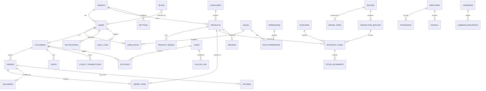
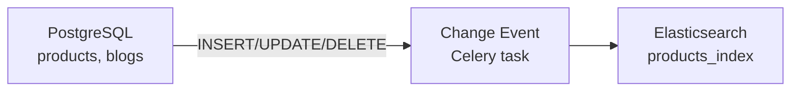

# Database Architecture — Archana Commerce OS

## 1. Database Strategy

| Decision | Choice | Rationale |
|----------|--------|-----------|
| Engine | PostgreSQL 17 | ACID, JSONB, RLS, full-text, mature ecosystem |
| Tenancy | Shared schema + `tenant_id` | Cost-effective; RLS for isolation |
| ORM | SQLAlchemy 2.0 (async) | Type-safe, Alembic migrations |
| Migrations | Alembic | Version-controlled, reversible |
| Search index | Elasticsearch | Product search, AI RAG (synced from PG) |
| Cache | Redis | Sessions, rate limits, hot queries |
| IDs | UUID v7 | Time-sortable, globally unique |
| Timestamps | `timestamptz` UTC | All tables |
| Soft delete | `deleted_at` nullable | Recoverable deletes |
| Audit | `audit_logs` table | All mutations logged |

---

## 2. Entity Relationship Overview



---

## 3. Schema Domains

### 3.1 Platform & Auth

#### `tenants`
| Column | Type | Constraints |
|--------|------|-------------|
| id | UUID | PK |
| name | VARCHAR(255) | NOT NULL |
| slug | VARCHAR(100) | UNIQUE, NOT NULL |
| domain | VARCHAR(255) | UNIQUE, nullable |
| plan | ENUM | free, starter, pro, enterprise |
| status | ENUM | active, suspended, trial |
| settings | JSONB | DEFAULT '{}' |
| created_at | TIMESTAMPTZ | NOT NULL |
| updated_at | TIMESTAMPTZ | NOT NULL |

#### `users`
| Column | Type | Constraints |
|--------|------|-------------|
| id | UUID | PK |
| tenant_id | UUID | FK → tenants, NOT NULL |
| email | VARCHAR(255) | NOT NULL |
| phone | VARCHAR(20) | nullable |
| password_hash | VARCHAR(255) | nullable (OAuth users) |
| first_name | VARCHAR(100) | NOT NULL |
| last_name | VARCHAR(100) | nullable |
| avatar_url | TEXT | nullable |
| auth_provider | ENUM | email, google, otp |
| email_verified | BOOLEAN | DEFAULT false |
| is_active | BOOLEAN | DEFAULT true |
| last_login_at | TIMESTAMPTZ | nullable |
| created_at | TIMESTAMPTZ | NOT NULL |
| updated_at | TIMESTAMPTZ | NOT NULL |
| deleted_at | TIMESTAMPTZ | nullable |

**Indexes**: `UNIQUE(tenant_id, email)`, `INDEX(tenant_id, phone)`

#### `roles`
| Column | Type | Constraints |
|--------|------|-------------|
| id | UUID | PK |
| tenant_id | UUID | FK → tenants |
| name | VARCHAR(100) | NOT NULL |
| slug | VARCHAR(100) | NOT NULL |
| description | TEXT | nullable |
| is_system | BOOLEAN | DEFAULT false |

**Indexes**: `UNIQUE(tenant_id, slug)`

#### `permissions`
| Column | Type | Constraints |
|--------|------|-------------|
| id | UUID | PK |
| module | VARCHAR(50) | NOT NULL |
| action | VARCHAR(50) | NOT NULL |
| description | TEXT | nullable |

**Indexes**: `UNIQUE(module, action)`

#### `role_permissions` (junction)
| role_id | UUID | FK → roles |
| permission_id | UUID | FK → permissions |

#### `user_roles` (junction)
| user_id | UUID | FK → users |
| role_id | UUID | FK → roles |

---

### 3.2 Ecommerce

#### `categories`
| Column | Type | Constraints |
|--------|------|-------------|
| id | UUID | PK |
| tenant_id | UUID | FK → tenants |
| parent_id | UUID | FK → categories, nullable |
| name | VARCHAR(255) | NOT NULL |
| slug | VARCHAR(255) | NOT NULL |
| description | TEXT | nullable |
| image_url | TEXT | nullable |
| sort_order | INT | DEFAULT 0 |
| is_active | BOOLEAN | DEFAULT true |

**Indexes**: `UNIQUE(tenant_id, slug)`, `INDEX(tenant_id, parent_id)`

#### `products`
| Column | Type | Constraints |
|--------|------|-------------|
| id | UUID | PK |
| tenant_id | UUID | FK → tenants |
| category_id | UUID | FK → categories |
| sku | VARCHAR(100) | NOT NULL |
| name | VARCHAR(255) | NOT NULL |
| slug | VARCHAR(255) | NOT NULL |
| description | TEXT | nullable |
| short_description | VARCHAR(500) | nullable |
| price | DECIMAL(12,2) | NOT NULL |
| compare_at_price | DECIMAL(12,2) | nullable |
| cost_price | DECIMAL(12,2) | nullable |
| weight_grams | INT | nullable |
| is_active | BOOLEAN | DEFAULT true |
| is_featured | BOOLEAN | DEFAULT false |
| stock_status | ENUM | in_stock, out_of_stock, preorder |
| metadata | JSONB | DEFAULT '{}' |
| seo_title | VARCHAR(255) | nullable |
| seo_description | TEXT | nullable |
| created_at | TIMESTAMPTZ | NOT NULL |
| updated_at | TIMESTAMPTZ | NOT NULL |
| deleted_at | TIMESTAMPTZ | nullable |

**Indexes**: `UNIQUE(tenant_id, slug)`, `UNIQUE(tenant_id, sku)`, `GIN(metadata)`

#### `product_images`
| Column | Type | Constraints |
|--------|------|-------------|
| id | UUID | PK |
| product_id | UUID | FK → products |
| url | TEXT | NOT NULL |
| alt_text | VARCHAR(255) | nullable |
| sort_order | INT | DEFAULT 0 |
| is_primary | BOOLEAN | DEFAULT false |

#### `carts` / `cart_items`
Standard cart with `user_id`, `session_id` (guest), `product_id`, `quantity`.

#### `customers`
| Column | Type | Constraints |
|--------|------|-------------|
| id | UUID | PK |
| tenant_id | UUID | FK → tenants |
| user_id | UUID | FK → users, nullable |
| email | VARCHAR(255) | NOT NULL |
| phone | VARCHAR(20) | nullable |
| first_name | VARCHAR(100) | NOT NULL |
| last_name | VARCHAR(100) | nullable |
| total_orders | INT | DEFAULT 0 |
| total_spent | DECIMAL(14,2) | DEFAULT 0 |
| loyalty_points | INT | DEFAULT 0 |
| tags | TEXT[] | DEFAULT '{}' |
| metadata | JSONB | DEFAULT '{}' |

---

### 3.3 Orders

#### `orders`
| Column | Type | Constraints |
|--------|------|-------------|
| id | UUID | PK |
| tenant_id | UUID | FK → tenants |
| customer_id | UUID | FK → customers |
| order_number | VARCHAR(50) | NOT NULL |
| status | ENUM | pending, confirmed, processing, shipped, delivered, cancelled, returned |
| payment_status | ENUM | pending, paid, failed, refunded, partial_refund |
| subtotal | DECIMAL(12,2) | NOT NULL |
| tax_amount | DECIMAL(12,2) | DEFAULT 0 |
| shipping_amount | DECIMAL(12,2) | DEFAULT 0 |
| discount_amount | DECIMAL(12,2) | DEFAULT 0 |
| total_amount | DECIMAL(12,2) | NOT NULL |
| currency | VARCHAR(3) | DEFAULT 'INR' |
| shipping_address | JSONB | NOT NULL |
| billing_address | JSONB | nullable |
| notes | TEXT | nullable |
| tracking_id | VARCHAR(100) | UNIQUE, nullable |
| placed_at | TIMESTAMPTZ | NOT NULL |
| created_at | TIMESTAMPTZ | NOT NULL |
| updated_at | TIMESTAMPTZ | NOT NULL |

**Indexes**: `UNIQUE(tenant_id, order_number)`, `INDEX(tenant_id, status)`, `INDEX(tenant_id, customer_id)`

#### `order_items`
| Column | Type | Constraints |
|--------|------|-------------|
| id | UUID | PK |
| order_id | UUID | FK → orders |
| product_id | UUID | FK → products |
| product_name | VARCHAR(255) | NOT NULL (snapshot) |
| sku | VARCHAR(100) | NOT NULL (snapshot) |
| quantity | INT | NOT NULL |
| unit_price | DECIMAL(12,2) | NOT NULL |
| total_price | DECIMAL(12,2) | NOT NULL |

---

### 3.4 CRM

#### `leads`
| Column | Type | Constraints |
|--------|------|-------------|
| id | UUID | PK |
| tenant_id | UUID | FK → tenants |
| assigned_to | UUID | FK → users, nullable |
| name | VARCHAR(255) | NOT NULL |
| email | VARCHAR(255) | nullable |
| phone | VARCHAR(20) | nullable |
| source | ENUM | website, whatsapp, referral, walk_in, campaign |
| status | ENUM | new, contacted, qualified, converted, lost |
| score | INT | DEFAULT 0 |
| notes | TEXT | nullable |
| converted_customer_id | UUID | FK → customers, nullable |

#### `activities`
| Column | Type | Constraints |
|--------|------|-------------|
| id | UUID | PK |
| tenant_id | UUID | FK → tenants |
| lead_id | UUID | FK → leads, nullable |
| customer_id | UUID | FK → customers, nullable |
| user_id | UUID | FK → users |
| type | ENUM | call, email, meeting, note, whatsapp |
| description | TEXT | NOT NULL |
| occurred_at | TIMESTAMPTZ | NOT NULL |

#### `follow_ups`
| Column | Type | Constraints |
|--------|------|-------------|
| id | UUID | PK |
| lead_id | UUID | FK → leads |
| assigned_to | UUID | FK → users |
| scheduled_at | TIMESTAMPTZ | NOT NULL |
| completed_at | TIMESTAMPTZ | nullable |
| status | ENUM | pending, completed, overdue, cancelled |
| notes | TEXT | nullable |

---

### 3.5 Inventory & Production

#### `suppliers`
| Column | Type | Constraints |
|--------|------|-------------|
| id | UUID | PK |
| tenant_id | UUID | FK → tenants |
| name | VARCHAR(255) | NOT NULL |
| contact_person | VARCHAR(255) | nullable |
| email | VARCHAR(255) | nullable |
| phone | VARCHAR(20) | nullable |
| address | JSONB | nullable |
| is_active | BOOLEAN | DEFAULT true |

#### `inventory_items`
| Column | Type | Constraints |
|--------|------|-------------|
| id | UUID | PK |
| tenant_id | UUID | FK → tenants |
| product_id | UUID | FK → products, nullable |
| supplier_id | UUID | FK → suppliers, nullable |
| name | VARCHAR(255) | NOT NULL |
| sku | VARCHAR(100) | NOT NULL |
| type | ENUM | raw_material, finished_good, packaging |
| quantity | DECIMAL(12,3) | NOT NULL |
| unit | ENUM | kg, g, l, ml, pcs, box |
| reorder_level | DECIMAL(12,3) | DEFAULT 0 |
| cost_per_unit | DECIMAL(12,2) | nullable |
| location | VARCHAR(100) | nullable |

#### `stock_movements`
| Column | Type | Constraints |
|--------|------|-------------|
| id | UUID | PK |
| inventory_item_id | UUID | FK → inventory_items |
| type | ENUM | purchase, production, sale, adjustment, wastage |
| quantity | DECIMAL(12,3) | NOT NULL (signed) |
| reference_type | VARCHAR(50) | nullable |
| reference_id | UUID | nullable |
| notes | TEXT | nullable |
| created_by | UUID | FK → users |
| created_at | TIMESTAMPTZ | NOT NULL |

#### `recipes`
| Column | Type | Constraints |
|--------|------|-------------|
| id | UUID | PK |
| tenant_id | UUID | FK → tenants |
| product_id | UUID | FK → products |
| name | VARCHAR(255) | NOT NULL |
| yield_quantity | DECIMAL(12,3) | NOT NULL |
| yield_unit | ENUM | kg, g, pcs, box |
| instructions | TEXT | nullable |

#### `recipe_items`
| recipe_id | UUID | FK → recipes |
| inventory_item_id | UUID | FK → inventory_items |
| quantity | DECIMAL(12,3) | NOT NULL |
| unit | ENUM | kg, g, l, ml, pcs |

#### `production_batches`
| Column | Type | Constraints |
|--------|------|-------------|
| id | UUID | PK |
| tenant_id | UUID | FK → tenants |
| recipe_id | UUID | FK → recipes |
| batch_number | VARCHAR(50) | NOT NULL |
| status | ENUM | planned, in_progress, completed, cancelled |
| planned_quantity | DECIMAL(12,3) | NOT NULL |
| actual_quantity | DECIMAL(12,3) | nullable |
| started_at | TIMESTAMPTZ | nullable |
| completed_at | TIMESTAMPTZ | nullable |
| created_by | UUID | FK → users |

---

### 3.6 Delivery

#### `deliveries`
| Column | Type | Constraints |
|--------|------|-------------|
| id | UUID | PK |
| tenant_id | UUID | FK → tenants |
| order_id | UUID | FK → orders |
| driver_id | UUID | FK → users, nullable |
| status | ENUM | assigned, picked_up, in_transit, delivered, failed |
| otp | VARCHAR(6) | nullable |
| otp_verified_at | TIMESTAMPTZ | nullable |
| estimated_delivery_at | TIMESTAMPTZ | nullable |
| delivered_at | TIMESTAMPTZ | nullable |
| route_data | JSONB | nullable |

#### `delivery_tracking`
| Column | Type | Constraints |
|--------|------|-------------|
| id | UUID | PK |
| delivery_id | UUID | FK → deliveries |
| latitude | DECIMAL(10,7) | NOT NULL |
| longitude | DECIMAL(10,7) | NOT NULL |
| recorded_at | TIMESTAMPTZ | NOT NULL |

---

### 3.7 HRMS

#### `employees`
| Column | Type | Constraints |
|--------|------|-------------|
| id | UUID | PK |
| tenant_id | UUID | FK → tenants |
| user_id | UUID | FK → users, nullable |
| employee_code | VARCHAR(50) | NOT NULL |
| department | VARCHAR(100) | nullable |
| designation | VARCHAR(100) | nullable |
| joining_date | DATE | NOT NULL |
| salary | DECIMAL(12,2) | nullable |
| is_active | BOOLEAN | DEFAULT true |

#### `attendance`
| Column | Type | Constraints |
|--------|------|-------------|
| id | UUID | PK |
| employee_id | UUID | FK → employees |
| date | DATE | NOT NULL |
| check_in | TIMESTAMPTZ | nullable |
| check_out | TIMESTAMPTZ | nullable |
| status | ENUM | present, absent, half_day, leave |

#### `payroll`
| Column | Type | Constraints |
|--------|------|-------------|
| id | UUID | PK |
| tenant_id | UUID | FK → tenants |
| employee_id | UUID | FK → employees |
| period_start | DATE | NOT NULL |
| period_end | DATE | NOT NULL |
| basic_salary | DECIMAL(12,2) | NOT NULL |
| deductions | DECIMAL(12,2) | DEFAULT 0 |
| net_salary | DECIMAL(12,2) | NOT NULL |
| status | ENUM | draft, processed, paid |
| paid_at | TIMESTAMPTZ | nullable |

---

### 3.8 Marketing & Loyalty

#### `campaigns`
| Column | Type | Constraints |
|--------|------|-------------|
| id | UUID | PK |
| tenant_id | UUID | FK → tenants |
| name | VARCHAR(255) | NOT NULL |
| channel | ENUM | email, whatsapp, sms, push |
| status | ENUM | draft, scheduled, sending, completed, cancelled |
| content | JSONB | NOT NULL |
| scheduled_at | TIMESTAMPTZ | nullable |
| sent_count | INT | DEFAULT 0 |

#### `loyalty_transactions`
| Column | Type | Constraints |
|--------|------|-------------|
| id | UUID | PK |
| customer_id | UUID | FK → customers |
| order_id | UUID | FK → orders, nullable |
| type | ENUM | earn, redeem, expire, adjust |
| points | INT | NOT NULL (signed) |
| balance_after | INT | NOT NULL |
| description | TEXT | nullable |

---

### 3.9 Content & Engagement

#### `reviews`
| product_id | UUID | FK → products |
| customer_id | UUID | FK → customers |
| rating | INT | CHECK 1-5 |
| comment | TEXT | nullable |
| is_approved | BOOLEAN | DEFAULT false |

#### `blogs`
| tenant_id | UUID | FK → tenants |
| author_id | UUID | FK → users |
| title | VARCHAR(255) | NOT NULL |
| slug | VARCHAR(255) | NOT NULL |
| content | TEXT | NOT NULL |
| status | ENUM | draft, published, archived |
| published_at | TIMESTAMPTZ | nullable |

#### `notifications`
| user_id | UUID | FK → users |
| type | VARCHAR(50) | NOT NULL |
| title | VARCHAR(255) | NOT NULL |
| body | TEXT | nullable |
| data | JSONB | DEFAULT '{}' |
| is_read | BOOLEAN | DEFAULT false |
| read_at | TIMESTAMPTZ | nullable |

---

### 3.10 System

#### `audit_logs`
| Column | Type | Constraints |
|--------|------|-------------|
| id | UUID | PK |
| tenant_id | UUID | FK → tenants |
| user_id | UUID | FK → users, nullable |
| action | VARCHAR(50) | NOT NULL |
| entity_type | VARCHAR(50) | NOT NULL |
| entity_id | UUID | NOT NULL |
| old_values | JSONB | nullable |
| new_values | JSONB | nullable |
| ip_address | INET | nullable |
| user_agent | TEXT | nullable |
| created_at | TIMESTAMPTZ | NOT NULL |

**Indexes**: `INDEX(tenant_id, entity_type, entity_id)`, `INDEX(tenant_id, created_at)`

#### `settings`
| Column | Type | Constraints |
|--------|------|-------------|
| id | UUID | PK |
| tenant_id | UUID | FK → tenants |
| key | VARCHAR(100) | NOT NULL |
| value | JSONB | NOT NULL |
| updated_at | TIMESTAMPTZ | NOT NULL |

**Indexes**: `UNIQUE(tenant_id, key)`

---

### 3.11 AI (Phase 4)

#### `ai_conversations`
| user_id | UUID | FK → users |
| agent_type | ENUM | chatbot, support, analytics, marketing |
| context | JSONB | DEFAULT '{}' |
| created_at | TIMESTAMPTZ | NOT NULL |

#### `ai_messages`
| conversation_id | UUID | FK → ai_conversations |
| role | ENUM | user, assistant, system |
| content | TEXT | NOT NULL |
| tokens_used | INT | nullable |
| created_at | TIMESTAMPTZ | NOT NULL |

#### `vector_embeddings`
| tenant_id | UUID | FK → tenants |
| source_type | VARCHAR(50) | product, blog, faq |
| source_id | UUID | NOT NULL |
| embedding | VECTOR(1536) | pgvector extension |
| content_hash | VARCHAR(64) | NOT NULL |
| metadata | JSONB | DEFAULT '{}' |

---

### 3.12 SaaS (Phase 5)

#### `franchises`
| tenant_id | UUID | FK → tenants (parent) |
| franchise_tenant_id | UUID | FK → tenants |
| name | VARCHAR(255) | NOT NULL |
| territory | JSONB | nullable |
| commission_rate | DECIMAL(5,2) | nullable |

#### `vendors`
| tenant_id | UUID | FK → tenants |
| name | VARCHAR(255) | NOT NULL |
| contact_email | VARCHAR(255) | NOT NULL |
| status | ENUM | pending, active, suspended |

#### `marketplace_listings`
| vendor_id | UUID | FK → vendors |
| product_id | UUID | FK → products |
| status | ENUM | pending_review, active, rejected |

---

## 4. Row-Level Security (Phase 5)

```sql
ALTER TABLE products ENABLE ROW LEVEL SECURITY;

CREATE POLICY tenant_isolation ON products
  USING (tenant_id = current_setting('app.tenant_id')::uuid);
```

Set per-request via SQLAlchemy event:
```python
# SET LOCAL app.tenant_id = '{tenant_uuid}'
```

---

## 5. Indexing Strategy

| Pattern | Index Type | Example |
|---------|-----------|---------|
| Tenant-scoped lookups | B-tree composite | `(tenant_id, status)` |
| Unique slugs/SKUs | B-tree unique | `(tenant_id, slug)` |
| Full-text search | GIN tsvector | `to_tsvector('english', name \|\| ' ' \|\| description)` |
| JSONB metadata | GIN | `metadata` |
| Time-series queries | B-tree | `(tenant_id, created_at DESC)` |
| Audit trail | B-tree | `(tenant_id, entity_type, created_at)` |

---

## 6. Migration Strategy

```
database/
├── schema/
│   ├── 001_platform.sql          # tenants, users, roles, permissions
│   ├── 002_ecommerce.sql         # products, categories, carts
│   ├── 003_orders.sql
│   ├── 004_crm.sql
│   ├── 005_inventory.sql
│   ├── 006_production.sql
│   ├── 007_delivery.sql
│   ├── 008_hrms.sql
│   ├── 009_marketing.sql
│   ├── 010_loyalty.sql
│   ├── 011_content.sql           # reviews, blogs
│   ├── 012_ai.sql
│   └── 013_saas.sql
├── migrations/                   # Alembic auto-generated revisions
├── seeders/
│   ├── 001_roles_permissions.py
│   ├── 002_demo_products.py
│   └── 003_demo_tenant.py
└── backups/
```

### Migration Rules

1. Every migration is reversible (`upgrade` + `downgrade`)
2. No destructive migrations in production without data backup
3. Large table changes use concurrent index creation
4. Seeders are idempotent (safe to re-run)
5. Schema files are reference docs; Alembic is source of truth

---

## 7. Data Sync: PostgreSQL → Elasticsearch



Indexed fields: `name`, `description`, `category`, `price`, `tags`, `tenant_id`

---

## 8. Backup & Recovery

| Type | Frequency | Retention | Location |
|------|-----------|-----------|----------|
| Full PG backup | Daily | 30 days | S3 `backups/pg/` |
| WAL archiving | Continuous | 7 days | S3 `backups/wal/` |
| Redis RDB | Hourly | 3 days | S3 `backups/redis/` |
| ES snapshots | Daily | 14 days | S3 `backups/es/` |

Scripts in `scripts/backup/`.

---

## 9. Performance Targets

| Query Type | Target (p95) |
|-----------|-------------|
| Product listing | < 50ms |
| Order detail | < 30ms |
| Dashboard analytics | < 200ms |
| Full-text search | < 100ms |
| AI RAG retrieval | < 500ms |

Strategies: Redis caching for hot reads, read replicas for analytics, materialized views for dashboard aggregates (refreshed via Celery).
