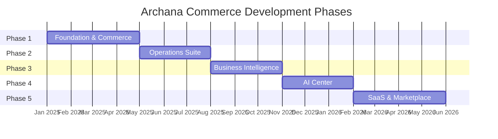

# Development Roadmap — Archana Commerce OS

## Overview

Five phases delivering incremental business value. Each phase ends with a deployable, testable milestone. No phase begins until the prior phase exit criteria are met.

---

## Phase 1: Foundation & Commerce Core

**Duration**: 16 weeks &nbsp;|&nbsp; **Team**: 6–8 engineers

### Goals

Establish monorepo tooling, authentication, RBAC, database, customer website, admin dashboard, product catalog, and order management.

### Deliverables

#### 1.1 Monorepo Infrastructure (Week 1–2)

| Task | Owner | Output |
|------|-------|--------|
| Initialize pnpm workspace + Turborepo | DevOps | `package.json`, `pnpm-workspace.yaml`, `turbo.json` |
| Shared TS config packages | Frontend | `@archana/config` |
| Docker Compose dev environment | DevOps | `infrastructure/docker/docker-compose.dev.yml` |
| CI pipeline (lint, typecheck, test) | DevOps | GitHub Actions workflows |
| Backend project scaffold | Backend | `pyproject.toml`, FastAPI app factory |
| Alembic setup | Backend | Initial migration framework |

**Exit**: `pnpm install && docker compose up && pnpm dev` starts all services.

#### 1.2 Database & Auth (Week 3–5)

| Task | Output |
|------|--------|
| Migration: tenants, users, roles, permissions | `database/migrations/001_platform` |
| Auth module: register, login, OTP, Google OAuth | `backend/auth/` |
| JWT + refresh token rotation | Redis-backed token store |
| RBAC middleware + permission decorators | `backend/api/dependencies/auth.py` |
| User management endpoints | `backend/users/` |
| Seed roles: super_admin, admin, manager, staff, customer | `database/seeders/001_roles_permissions.py` |
| Audit logging middleware | `audit_logs` table + middleware |

**Exit**: Login → receive JWT → access protected endpoint with correct RBAC enforcement.

#### 1.3 Shared Packages (Week 4–6)

| Package | Contents |
|---------|----------|
| `@archana/types` | User, Product, Order, Auth interfaces |
| `@archana/constants` | Routes, permissions, enums |
| `@archana/validators` | Zod schemas mirroring Pydantic |
| `@archana/utils` | API client, formatters |
| `@archana/ui` | Shadcn setup: Button, Input, Card, Table, Dialog, Form |
| `@archana/hooks` | `useAuth`, `useProducts`, `useOrders` |

#### 1.4 Ecommerce Backend (Week 5–8)

| Task | Output |
|------|--------|
| Products CRUD + categories | `backend/ecommerce/` |
| Product images → S3 upload | S3 integration in `backend/core/storage.py` |
| Cart management (guest + authenticated) | Cart endpoints |
| Checkout flow (payment gateway integration) | Checkout + order creation |
| Orders module: create, list, detail, status updates | `backend/orders/` |
| Elasticsearch product indexing | Sync task via Celery |
| OpenAPI spec generation | `/api/v1/openapi.json` |

#### 1.5 Website (Week 6–10)

| Route | Features |
|-------|----------|
| `/` | Hero, featured products, categories |
| `/shop` | Product grid, filters, search |
| `/category/[slug]` | Category product listing |
| `/product/[slug]` | Product detail, images, add to cart |
| `/cart` | Cart management |
| `/checkout` | Address, payment, order confirmation |
| `/account` | Profile, addresses |
| `/account/orders` | Order history |
| `/auth/login`, `/auth/register` | Auth flows |
| `/track-order` | Public order tracking |

#### 1.6 Dashboard (Week 8–12)

| Route | Features |
|-------|----------|
| `/dashboard` | Overview KPIs (orders, revenue) |
| `/ecommerce/products` | Product CRUD table |
| `/ecommerce/categories` | Category management |
| `/orders` | Order list, detail, status management |
| `/settings` | Tenant settings |
| `/administration/users` | User & role management |

#### 1.7 Notifications (Week 10–12)

| Task | Output |
|------|--------|
| Email notifications (order confirmation, welcome) | `backend/notifications/` + Celery |
| Notification preferences | User settings |

### Phase 1 Exit Criteria

- [ ] Customer can browse, cart, checkout, and track orders on website
- [ ] Admin can manage products, categories, orders, users in dashboard
- [ ] Auth + RBAC enforced on all endpoints
- [ ] 80% backend test coverage on services
- [ ] CI green on all PRs
- [ ] Deployed to staging on AWS

---

## Phase 2: Operations Suite

**Duration**: 12 weeks &nbsp;|&nbsp; **Team**: 6–8 engineers

### Goals

CRM for customer relationships, inventory management, production planning, and delivery tracking.

### Deliverables

#### 2.1 CRM (Week 1–4)

| Feature | Routes |
|---------|--------|
| Lead management | Dashboard `/crm/leads`, API `/api/v1/crm/leads` |
| Customer 360 view | Dashboard `/crm/customers/[id]` |
| Activity logging | API `/api/v1/crm/activities` |
| Follow-up scheduler | Dashboard `/crm/follow-ups` |
| Lead → Customer conversion | Service layer event |

#### 2.2 Inventory (Week 3–6)

| Feature | Routes |
|---------|--------|
| Raw material tracking | Dashboard `/inventory/materials` |
| Finished goods stock | Dashboard `/inventory/products` |
| Supplier management | Dashboard `/inventory/suppliers` |
| Stock movements | API `/api/v1/inventory/movements` |
| Low stock alerts | Celery scheduled task → notifications |

#### 2.3 Production (Week 5–8)

| Feature | Routes |
|---------|--------|
| Recipe management | Dashboard `/production/recipes` |
| Batch production | Dashboard `/production/batches` |
| Production planning calendar | Dashboard `/production/planning` |
| Auto-deduct raw materials on batch completion | Event: `batch.completed` → inventory |

#### 2.4 Delivery (Week 6–10)

| Feature | Routes |
|---------|--------|
| Delivery assignment | Dashboard `/delivery/assignments` |
| Driver mobile screens | Mobile `src/delivery/` |
| OTP delivery verification | API + mobile |
| Live tracking | SSE `/api/v1/stream/delivery/{id}` |
| Route optimization | Google Maps API integration |
| Website `/track-order` enhancement | Real-time map |

#### 2.5 Mobile App — Operations (Week 8–12)

| Role | Screens |
|------|---------|
| `delivery` | Assignments, navigation, OTP verify, status updates |
| `inventory` | Stock scan, movement recording, low stock view |
| `admin` | Quick order view, approve actions |

### Phase 2 Exit Criteria

- [ ] Sales team manages leads and follow-ups in CRM
- [ ] Inventory tracks raw materials and finished goods with movement history
- [ ] Production batches deduct inventory automatically
- [ ] Delivery drivers use mobile app with OTP verification
- [ ] Customers see real-time delivery tracking

---

## Phase 3: Business Intelligence

**Duration**: 12 weeks &nbsp;|&nbsp; **Team**: 5–7 engineers

### Goals

HRMS for employee management, marketing automation, analytics dashboards, and financial reporting.

### Deliverables

#### 3.1 HRMS (Week 1–4)

| Feature | Routes |
|---------|--------|
| Employee management | Dashboard `/hrms/employees` |
| Attendance (check-in/out) | Dashboard + Mobile |
| Payroll generation | Dashboard `/hrms/payroll` |
| Leave management | Dashboard `/hrms/leaves` |

#### 3.2 Marketing (Week 3–7)

| Feature | Routes |
|---------|--------|
| Email campaigns | Dashboard `/marketing/campaigns` |
| WhatsApp messaging | Dashboard `/marketing/whatsapp` |
| SEO page management | Dashboard `/marketing/seo` |
| Customer segmentation | Dashboard `/marketing/segments` |
| Campaign analytics | Open/click tracking |

#### 3.3 Loyalty (Week 5–7)

| Feature | Routes |
|---------|--------|
| Points earning on orders | Event: `order.delivered` → loyalty |
| Rewards catalog | Website `/loyalty` |
| Points redemption at checkout | Checkout integration |

#### 3.4 Finance (Week 6–8)

| Feature | Routes |
|---------|--------|
| Invoice generation | Dashboard `/finance/invoices` |
| Payment reconciliation | Dashboard `/finance/payments` |
| Revenue ledger | Dashboard `/finance/ledger` |

#### 3.5 Analytics (Week 7–10)

| Feature | Routes |
|---------|--------|
| Revenue dashboard | Dashboard `/analytics/revenue` |
| Sales analytics | Dashboard `/analytics/sales` |
| Customer analytics | Dashboard `/analytics/customers` |
| Product performance | Dashboard `/analytics/products` |
| Materialized views for aggregates | Celery refresh every 15min |

#### 3.6 Reports (Week 9–12)

| Feature | Output |
|---------|--------|
| PDF/Excel report generation | Celery async → S3 download |
| Scheduled reports | Cron → email delivery |
| Report templates | Sales, inventory, payroll, tax |

#### 3.7 Website Content (Week 8–10)

| Route | Features |
|-------|----------|
| `/blog` | Blog listing and detail |
| `/franchise` | Franchise inquiry form → CRM lead |
| `/corporate` | Corporate gifting |
| `/bulk-order` | Bulk order form |
| `/store-locator` | Store map |

### Phase 3 Exit Criteria

- [ ] HR team manages employees, attendance, payroll
- [ ] Marketing sends email and WhatsApp campaigns
- [ ] Analytics dashboards show real-time business KPIs
- [ ] Reports generate and download correctly
- [ ] Loyalty program active on website

---

## Phase 4: AI Center

**Duration**: 12 weeks &nbsp;|&nbsp; **Team**: 4–6 engineers (incl. ML)

### Goals

Deploy AI capabilities across customer support, marketing, inventory, sales, and analytics.

### Deliverables

#### 4.1 AI Infrastructure (Week 1–3)

| Task | Output |
|------|--------|
| LLM client abstraction | `backend/ai/core/llm_client.py` |
| Vector DB setup (pgvector or Pinecone) | `backend/ai/vector-db/` |
| RAG pipeline | `backend/ai/rag/` — ingest, embed, retrieve |
| LangGraph agent framework | `backend/ai/agents/` |
| Token usage tracking | `ai_usage_logs` table |
| AI rate limiting | 20 req/min per user |

#### 4.2 Customer Support AI (Week 3–5)

| Feature | Integration |
|---------|-------------|
| Website chatbot widget | `/ai/chat` with RAG on FAQs, products, orders |
| WhatsApp AI agent | `backend/ai/agents/whatsapp_agent.py` |
| Dashboard AI Center | `/ai-center/conversations` — human handoff |

#### 4.3 Business AI (Week 5–8)

| Feature | Module |
|---------|--------|
| Product recommendations | `backend/ai/recommendations/` — collaborative filtering + LLM |
| Demand forecasting | `backend/ai/forecasting/` — time series on sales data |
| SEO content writer | `backend/ai/seo-writer/` — meta tags, descriptions, blog drafts |
| Marketing copy generator | `backend/ai/marketing-assistant/` — campaign content |
| Inventory reorder suggestions | Forecasting → inventory alerts |

#### 4.4 Analytics AI (Week 7–10)

| Feature | Integration |
|---------|-------------|
| Natural language queries | "What was revenue last month?" → chart + data |
| Anomaly detection | Celery daily scan → alert notifications |
| Dashboard `/ai-center` | AI tool suite for admins |

#### 4.5 RAG Content Ingestion (Week 8–12)

| Source | Pipeline |
|--------|----------|
| Products | Auto-sync on create/update |
| Blogs | Ingest on publish |
| FAQs | Manual upload + auto-categorize |
| Order policies | Static document ingestion |

### Phase 4 Exit Criteria

- [ ] Chatbot answers product and order questions on website
- [ ] AI recommendations appear on product pages
- [ ] Demand forecasts inform production planning
- [ ] Marketing team generates campaign copy via AI
- [ ] Analytics AI answers natural language queries
- [ ] Token costs tracked per tenant

---

## Phase 5: SaaS & Marketplace

**Duration**: 16 weeks &nbsp;|&nbsp; **Team**: 6–10 engineers

### Goals

Multi-tenant SaaS platform with franchise management, vendor marketplace, and self-service onboarding.

### Deliverables

#### 5.1 Multi-Tenancy (Week 1–5)

| Task | Output |
|------|--------|
| Tenant resolver (subdomain + JWT) | Middleware |
| PostgreSQL RLS policies | All business tables |
| Tenant onboarding flow | Signup → provision → setup wizard |
| Subscription plans (free, starter, pro, enterprise) | Billing integration |
| Per-tenant settings isolation | Verified by integration tests |
| Tenant admin dashboard | `/administration/tenant` |

#### 5.2 Franchise Management (Week 4–8)

| Feature | Routes |
|---------|--------|
| Franchise onboarding | Dashboard `/administration/franchises` |
| Territory management | Franchise settings |
| Commission tracking | Finance integration |
| Franchise-scoped data visibility | Parent tenant sees all; franchise sees own |
| Franchise website template | Auto-provisioned subdomain |

#### 5.3 Vendor Marketplace (Week 6–10)

| Feature | Routes |
|---------|--------|
| Vendor registration & KYC | Vendor portal |
| Product listing approval workflow | Admin review queue |
| Multi-vendor cart & checkout | Website integration |
| Vendor payout management | Finance module |
| Vendor analytics dashboard | Vendor portal |

#### 5.4 SaaS Platform (Week 8–14)

| Feature | Output |
|---------|--------|
| Self-service tenant signup | Landing page → provisioning |
| Plan upgrade/downgrade | Stripe/Razorpay subscription |
| Usage metering | API calls, storage, AI tokens |
| White-label branding | Per-tenant logo, colors, domain |
| API keys for tenant integrations | Settings → API keys |
| SLA monitoring per tenant | Grafana dashboards |

#### 5.5 Mobile — Full Role Coverage (Week 10–14)

| Role | Screens |
|------|---------|
| `customer` | Full shopping experience |
| `crm` | Lead view, activity logging |
| `marketing` | Campaign monitoring |
| `profile` | Account, loyalty, notifications |
| `settings` | Preferences, notification settings |

#### 5.6 Production Hardening (Week 12–16)

| Task | Output |
|------|--------|
| Load testing (k6) | 10K concurrent users target |
| Security audit | Penetration test report |
| Disaster recovery drill | Backup restore verified |
| Documentation site | `apps/docs` fully populated |
| Runbooks | `docs/guides/runbooks/` |

### Phase 5 Exit Criteria

- [ ] New tenant can self-onboard and operate independently
- [ ] Franchise locations operate with scoped data access
- [ ] Vendors can list products and receive payouts
- [ ] Platform handles 10K concurrent users
- [ ] Security audit passed
- [ ] Full documentation published

---

## Cross-Phase Concerns

### Continuous (All Phases)

| Concern | Cadence |
|---------|---------|
| Security patches | Weekly |
| Dependency updates | Bi-weekly (Renovate bot) |
| Performance profiling | Monthly |
| Database maintenance | Weekly (VACUUM, index health) |
| Backup verification | Monthly restore drill |
| ADR documentation | Per significant decision |

### Team Structure

| Role | Count | Phases |
|------|-------|--------|
| Principal Architect | 1 | All |
| Backend Engineers | 2–3 | All |
| Frontend Engineers | 2–3 | 1–3, 5 |
| Mobile Engineer | 1 | 2, 5 |
| DevOps Engineer | 1 | All |
| ML/AI Engineer | 1 | 4–5 |
| QA Engineer | 1 | All |
| Product Manager | 1 | All |

### Risk Register

| Risk | Impact | Mitigation |
|------|--------|------------|
| Scope creep across modules | High | Strict phase gates; feature flags |
| AI API costs | Medium | Token budgets per tenant; caching |
| Multi-tenant data leak | Critical | RLS + integration tests + pen test |
| Payment gateway downtime | High | Graceful degradation; manual recording |
| Team scaling | Medium | Modular ownership; clear CODEOWNERS |
| Elasticsearch sync lag | Low | Fallback to PG full-text search |

---

## Milestone Summary

| Phase | Milestone | Key Metric |
|-------|-----------|------------|
| 1 | MVP Commerce Live | 100 orders processed |
| 2 | Operations Digital | 50 deliveries tracked via mobile |
| 3 | Business Intelligence | 10 automated campaigns sent |
| 4 | AI-Powered | 1000 chatbot conversations handled |
| 5 | SaaS Platform | 5 tenants onboarded |

---

## Next Steps

1. Review and approve this architecture with stakeholders
2. Set up development environment (Phase 1.1)
3. Create initial ADRs (001–004)
4. Begin Phase 1.2: Database & Auth implementation

> **Note**: This roadmap defines *what* to build and *when*. Implementation follows [CODING_STANDARDS.md](./CODING_STANDARDS.md) and architectural contracts in `docs/architecture/`, `docs/api/`, and `docs/database/`.
